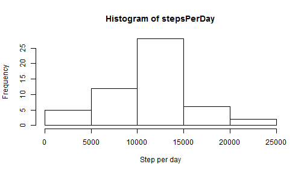

## Loading and preprocessing the data

```r
library(xtable)
library(plyr)
library(chron)
library(Hmisc)

setwd("C:/Users/Volodymyr_Novostavsk/Dropbox/tmp/coursera")
#getwd()
rawData <- read.csv("activity.csv")
#summary(rawData)
```


## What is mean total number of steps taken per day?

```r
stepsPerDay <- tapply(rawData$steps, rawData$date, sum, simplify = TRUE)
print(summary(stepsPerDay), type="html")
```

```
##    Min. 1st Qu.  Median    Mean 3rd Qu.    Max.    NA's 
##      41    8841   10760   10770   13290   21190       8
```

###1. Make a histogram of the total number of steps taken each day

```r
hist(stepsPerDay, xlab = "Step per day", ylab = "Frequency")
```

 

###2. Calculate and report the mean and median total number of steps taken per day

```r
meanValue <- mean(stepsPerDay, na.rm = TRUE)
medianValue <- median(stepsPerDay, na.rm = TRUE)
```
The calculated mean = 1.0766189 &times; 10<sup>4</sup>, and the median = 10765.

## What is the average daily activity pattern?

```r
meanPerInterval <- tapply(rawData$steps, rawData$interval, mean, na.rm=TRUE, simplify = TRUE)
print(summary(meanPerInterval), type="html")
```

```
##    Min. 1st Qu.  Median    Mean 3rd Qu.    Max. 
##   0.000   2.486  34.110  37.380  52.830 206.200
```

###1. Make a time series plot (i.e. type = "l") of the 5-minute interval (x-axis) and the average number of steps taken, averaged across all days (y-axis)

```r
plot(meanPerInterval, type = "l", xlab = "time interval", ylab = "the average number of steps")
```

 

###2. Which 5-minute interval, on average across all the days in the dataset, contains the maximum number of steps?

```r
maxInterval <- names(which.max(meanPerInterval))
```
The most steps in the interval 835.

## Imputing missing values
Note that there are a number of days/intervals where there are missing values (coded as NA). The presence of missing days may introduce bias into some calculations or summaries of the data.

###1. Calculate and report the total number of missing values in the dataset (i.e. the total number of rows with NAs)

```r
naValues <- sum(is.na(rawData$steps))
```
Missing 2304 number of values.

###2. Devise a strategy for filling in all of the missing values in the dataset. The strategy does not need to be sophisticated. For example, you could use the mean/median for that day, or the mean for that 5-minute interval, etc.
Let it be simple median value.

###3. Create a new dataset that is equal to the original dataset but with the missing data filled in.

```r
imputData <- rawData
imputData$steps <- impute(rawData$steps, fun=median)
```

###4. Make a histogram of the total number of steps taken each day and Calculate and report the mean and median total number of steps taken per day. Do these values differ from the estimates from the first part of the assignment? What is the impact of imputing missing data on the estimates of the total daily number of steps?

```r
stepsPerDayNoNA <- tapply(imputData$steps, imputData$date, sum, na.rm=TRUE, simplify = TRUE)
print(summary(stepsPerDayNoNA), type="html")
```

```
##    Min. 1st Qu.  Median    Mean 3rd Qu.    Max. 
##       0    6778   10400    9354   12810   21190
```
Histogram:

```r
hist(stepsPerDayNoNA, xlab = "Step per day no NA", ylab = "Frequency")
```

 
Stats:

```r
meanValueNA <- mean(stepsPerDayNoNA)
medianValueNA <- median(stepsPerDayNoNA)
```
The calculated mean = 9354.2295082, and the median = 1.0395 &times; 10<sup>4</sup>.

## Are there differences in activity patterns between weekdays and weekends?
For this part the weekdays() function may be of some help here. Use the dataset with the filled-in missing values for this part.

###1. Create a new factor variable in the dataset with two levels -- "weekday" and "weekend" indicating whether a given date is a weekday or weekend day.

```r
imputData$isWeekend <- chron::is.weekend(imputData$date)
```

###2. Make a panel plot containing a time series plot (i.e. type = "l") of the 5-minute interval (x-axis) and the average number of steps taken, averaged across all weekday days or weekend days (y-axis). The plot should look something like the following, which was created using simulated data:

```r
weekEndsStats <- aggregate(steps ~ interval + isWeekend, data=imputData, mean)
ggplot(weekEndsStats, aes(interval, steps, type = 'l')) + geom_line(aes(colour=isWeekend)) 
```

 
